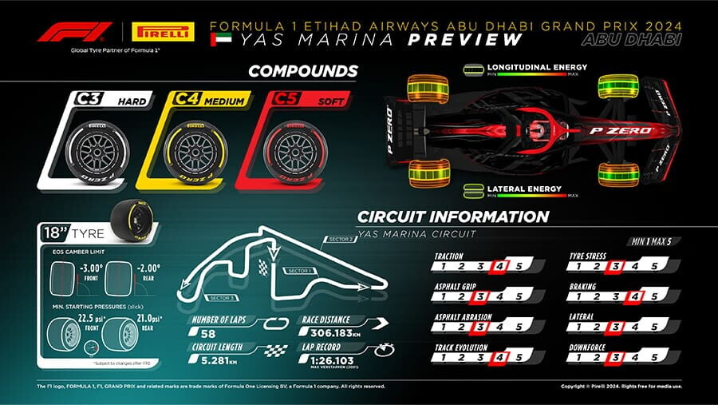

# 🏎️ F1 Predictions 2025 - Machine Learning project

Welcome to this machine learning project that aims to predict the winners and the podiums of the 2025 season with training data from 2022 to 2024 season. The project is inspired by @mar_antaya on Instagram and her GitHub repository.

# 🏆 Results
The best results for winner accuracy was 0.8 and for podium accuracy 0.76666... Gradient boosting is a greedy, stage-wise optimization algorithm that is sensitive to initialization and randomness, often converging to a locally optimal model. So a more common result is around 0.7, 0.7 for winner and podium accuracy. 

The model predicted Verstappen to win in three races where he did not, though two of these are understandable given his pole positions. The other race Verstappen started second misstake could be due to Verstappen's higher form score, even though Russell's race sim was better — highlighting how the model may prioritize recent results.

# 📊 Data

- **FastF1 API**: https://docs.fastf1.dev/ 

- **Pirelli track data**: https://www.pirelli.com/global/en-ww/emotions-and-numbers/formula-1-etihad-airways-abu-dhabi-grand-prix-2024-149872/

The data is used is stored in a parquet files so it doesn´t have to be retrieved everytime from the FastF1 api. Is a lot easier to view the data in a parquet file as well (Note: atleast for me I had to download a parquet viewer). The files that created the parquet files are included so you can update the 2025 data (Austrian GP previous race atm (Have not evaluated on it)). 

## Features

- **FastF1 API**:

The target feature (i.e the y variable) is the finished position, starting position, driver abbreviations, team name, track location, round, race sim, form score. 

Most of the features are self-explanatory except for the form score and race sim. 

The form score is sum of the five previous races with 1 * race points from the most recent race then 0.8 * race points from the second most recent race and so on. This is reset at the beginning of each season because the teams come with new cars each season, form score for every one is 0 for first race and second race have 0.2 * race points of first race. 

Teams often run race simulations during FP2, though the exact programs may vary. We look at the fastest sector times of each driver and include all sector times which lie within 0.3 second delta of the fastes sector time. Then take the mean of each sector time and then sum them together to get the race simulation. We normalise this for each race weekend because lap times vary greatly across tracks and we're primarily interested in relative pace within each weekend. The are some race weekends that are sprint weekends and that means there is no FP2 so we calculate the race sim from the sprint race in the same way but with a delta of 0.5 seconds instead. 

- **Pirelli track data**: 

Pirelli provides an analysis for each race weekend and the 8 information values from the bottom right of the image below are used as 8 individual features. 

- **Own feature**:

I created my own feature which is the track type, possible values are permanent and street. When creating this feature I thought about Sergio Perez who performed better at the street circuits in his time at Red Bull.

# 🏁 Running the code yourself
1. **Data Collection**: Run the test_dload notebook if you want to make sure you have the most updated test data (Note: you will have to change the np arange so it has the most recent races). Otherwise the data collection is done, you can load it into the F1_models notebook. 
2. **Preprocessing & Feature Engineering**: 
Remove data rows with Nan, normalize the numerical values, one hot encod the categorical data. 
3. **Model Training**: Have a notebook cell for each Sklearn model that was tried.
4. **Prediction**: The models predicts position, then ranks the driver for each race and maps them to the position equalling their rank. 
5. **Evaluation**: Model performance is measured using **R2-score**, **winner accuracy** and **podium accuracy**. Podium accuracy in this instance means that we place the correct drivers on the podium not that there exact postion are correct. 

### Dependencies
- `fastf1`
- `numpy`
- `pandas`
- `scikit-learn`
- `matplotlib`

# Improvments 

🌦️ Could add weather data to try to make model handle the craziness that can come from rain races, as seen in the Austrailian race this season. The cars nowadays produce a lot of spray so there almost never is a time where the full wet tires are used instead used the intermidiate tires are used or the race is red flagged due to the spray. For this to work well we would need to use the probability of rain a set amount of time before the race start. 

🛞 We could include something about what compunds pirelli have brought. They bring 3 compounds out of 5, but pirelli have added other softer compoud tire during this season which could complicate the implementation of this. They also update and modify the tires. 

The race sim feature could be improved because a driver does not drive on all tires types during FP2, so somehow modifing this feature to solve this. Another thing is it´s unknown how much fuel they are running during these sessions.

Something that was tested quickly was feature selection the model got a bit better results from this, and it felt like the results were better. Try diffrent amount of features but 3 most important should probably must be included. They are Grid position, form score and race sim. Where able to get the Jeddha race correct as well so 80% winning accuracy, believe that this is good result because you know that winner will be from a few drivers but getting the exact winner is in the 2025 season not always easy to predict (2023 where Verstappen won 19/22 races not to difficult to predict the winner).

Including more data could help the model see more complex patterns and trends. This is not that tricky to implement. I limited myself to having 2022 as the first season because they introduced big rule changes to that season which still apply. If you go back even further remark that refueling was banned at the end of the 2009 season, so this could introduce new patterns that are not applicable for the 2025 season. 

For the 2025 season they removed the fastest lap point but it´s included in the training data. Either adding a point for the driver that got the fastest lap for the 2025 season or removing the point in the training data. For the objective of predicting the winners and podiums 1 point from fastest lap compared to the winners 25 point is quite a small impact. 

Since the sectors over a lap can differ quite a bit it's difficult to have one delta for all sectors and same for the same sector on different track. Could swap the constant deltas for changing deltas to a percentage of fastest sector instead. For the sprint races we can do something similar or maybe use finished position of sprintrace and model the sprint weekends separetly from the "normal" weekends. 

# Hard to model
Costly driver mistakes like Piastri in Melbourne are hard for the model to predict because it´s a thing that has almost never happens. Maybe add a feature of costly mistakes during race in current season but then you need to have a clear definition of costly mistake and manually go through a whole race to identify them. 

Another thing that is hard to model is when there are safety cars at the end of races and what happens with a driver that only has hard tyres like Verstappen in Barcelona this season. Even more memorable is the safety car in penultemet race of 2021 season where Verstappen could overtake Hamilton only due to Latifi's crash that led to a safety car. Could have a feature of safety cars in previous year of the event but will be difficult to have when you introduce a new race. 

Tyre degradation is a important factor in a race, if you need to "save" tires that makes you slower. Having low tire degradation gives you more options for tire strategy, having more options is always a benefit. Tire temperatures could give insight in tire degradation but this data is unavailable because it´s proprietary and not included in the broadcast telemetry used by the FastF1 API. So a workaround can be to see how the lap time decreases in FP2 or at previous race and make this into a feature. Data that is avalible to us is RPM of each car and that can give some insights into tire degradation. When you lose grip at the rear in an F1 car this leads to sudden increases of the RPM, oversteering is an example of this. When tires are overheating (wear is a cause of this) or they are worn down this happens more frequently. Trying to make it into a feature seems difficult but could be possible. 

Another thing that happens sometimes are slow pitstops, could add feature for the slow pitstops for each team because you can lose positions due to this. But a pit like Bottas in Monaco 2021 where they broke the wheel nut so he had to retire is almost impossible to predict. 

In season rule changes happen like this years Monaco this season with 2 mandatory pits instead of 1, didn´t effect the front runners so much but the midfield forgot about racing and played tacticall games instead. Other rule changes like the one for the Spanish GP this year where they lowered the flex of the front wings, will likely be shown in race sim and qualifying. 

It happens that there are track changes in some way from year to year; new asphalt, change the drs zones and replace a corner. Affect of these "small" changes could make big diffrence in the amount of overtakes and that could effect the models performance. I don't really know how to implement this small changes. 

## 📜 License
This project is licensed under the MIT License.
